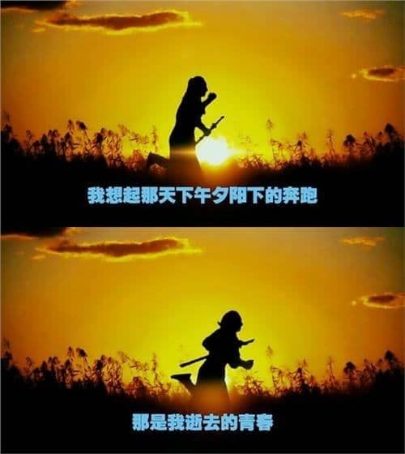

## Java

- <del>坦克大战</del>、<del>俄罗斯方块</del>（2013） ：学习java时，用awt画的小游戏
- <del>你画我猜</del>（2013）：java课程设计，最珍贵却不见了的程序
- 代码统计器（2013）：面试某兴趣小组的笔试题
  - 初衷是学习*正则表达式*，被硬生生用`indexOf`写了出来。
- 学生选课系统爬虫（2013）：申请[学生在线](https://www.online.sdu.edu.cn/index.html)的笔试题
  - [jsoup](http://jsoup.org/)爬网，貌似还赚了100块
- 大数计算器、word查看器、宾馆管理系统（2014）
  - 依次为`数据结构`、`软件设计与实现`、`数据库`的课程设计

## python

- 鼠标坦克（2013）：基于[pygame](https://www.pygame.org/)的纯鼠标操作的小游戏

## Javascript

- 3d赛车游戏（2015）：基于threejs魔改的3d游戏
- md编辑器（2015）：一个仿照mou的markdown编辑器
  - 第一次接触React，从此走上了前端不归路

## rails

- 小模特大赛（2016）：在韩都实习时的一个微信投票程序

